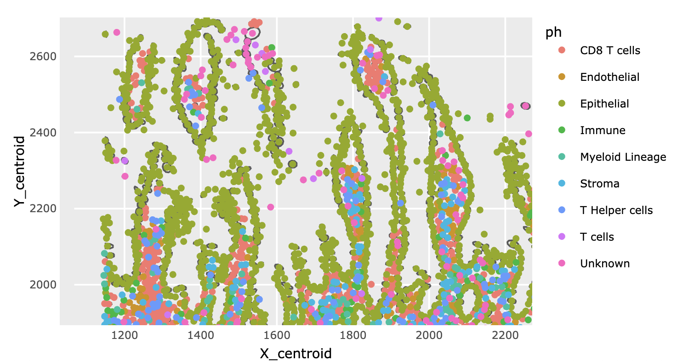

# multimodal2025

Some resources for exploring multimodal LLMs

## From GBCC.mcm app



### Quick dialogue with `llama3.2-vision:latest      6f2f9757ae97`

#### The interchange

```
>>> The image at https://github.com/vjcitn/multimodal2025/blob/main/mcmicro1.png includes a legend for color coding cell
...  types in the plane of the image.  How many different cell types are there?
Let me take a look at the image!

After examining the image, I see that the legend describes the color coding for 7 different cell types:

1. **CD8+ T cells** (red)
2. **CD4+ T cells** (blue)
3. **B cells** (green)
4. **Macrophages** (yellow)
5. **Dendritic cells** (orange)
6. **Mast cells** (purple)
7. **Erythrocytes** (pink)

So, there are **7** different cell types represented in the image, each with a unique color code.

>>> Thank you.  What kinds of patterns are present in the image?  Cells of one type may be collected within cells of ano
... ther type.
Upon closer inspection, I notice that the image appears to be a **2D projection of a 3D tissue structure**, likely 
a lymph node or a similar tissue type. The cells are densely packed and seem to be arranged in a complex, 
intricate pattern.

Some patterns that stand out in the image are:

1. **Nest-like structures**: Clusters of cells of the same type (e.g., CD8+ T cells) are often surrounded by other 
cells, forming a "nest" or "cluster" pattern.
2. **Cell aggregations**: Cells of different types are often found in close proximity to each other, sometimes 
even aggregating or clustering together (e.g., CD4+ T cells surrounding a macrophage).
3. **Tunnel-like structures**: The image appears to have some tunnel-like or channel-like features, which could be 
indicative of tissue architecture or the movement of cells through the tissue.
4. **Cell migration patterns**: The arrangement of cells and their interactions suggest that cell migration and 
movement are occurring in the tissue.

These patterns are likely indicative of the complex, dynamic behavior of cells in a living tissue, and may be 
related to immune responses, tissue development, or other biological processes.
```

### Interpretation

This model is unable to decode the text of the legend without extensive prompting.  The
pattern analysis is reasonable.

### Quick dialogue with perplexity.ai using Claude 4.0 Sonnet

I uploaded the mcmicro1.png and it was able to extract the cell types in legend accurately.

I uploaded "nolegend.png" and asked "What patterns are present in the image?  Do certain cell types cluster together more than others?"


---
Answer from Perplexity: pplx.ai/share
Looking at this spatial cell distribution image, several distinct patterns emerge:

## **Epithelial Cell Organization**
The olive green epithelial cells form highly organized, elongated tubular or crypt-like structures. These structures appear to be:
- **Branching and interconnected**, creating a network of tubular formations
- **Consistently shaped**, suggesting they represent functional tissue units like intestinal crypts or glandular ducts
- **Spatially coherent**, maintaining their structural integrity rather than being randomly scattered

## **Stromal Distribution**
The blue stromal cells show a complementary distribution pattern:
- **Concentrated heavily in the lower portion** of the tissue section
- **Filling interstitial spaces** between the epithelial structures
- **Supporting the epithelial architecture** by occupying the spaces around and between the tubular formations

## **Tissue Architecture**
The overall pattern reveals:
- **Clear compartmentalization** between epithelial and stromal regions
- **Organized tissue architecture** that resembles intestinal or glandular tissue, where epithelial cells form functional units (crypts/ducts) supported by stromal framework
- **Non-random spatial organization**, indicating this represents normal tissue architecture rather than disorganized pathological tissue

## **Additional Cell Types**
Other colored cells (pink, magenta, and additional colors) are scattered throughout but appear to be:
- **Less abundant** than the dominant epithelial and stromal populations
- **Distributed both within and around** the epithelial structures, possibly representing immune cells, endothelial cells, or other tissue components

This pattern is characteristic of well-organized epithelial tissue, likely intestinal mucosa with crypt structures supported by stromal elements.

Citations:
[1] https://pplx-res.cloudinary.com/image/private/user_uploads/6746978/ea220fdd-2b74-4e13-bd64-e4460cacd71d/nolegend.jpg

